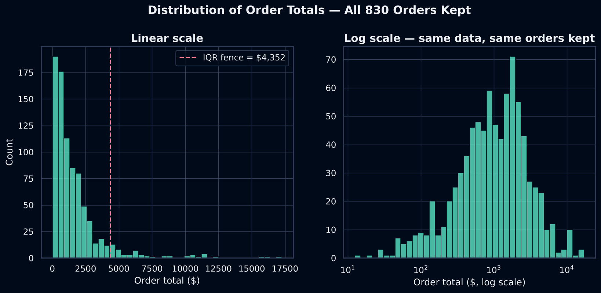

# 🧾 Northwind Sales & Orders Analysis

An EDA on 830 orders (2,161 order-product lines) from the classic Northwind sales database: who buys, from where, how much — and why trusting a textbook outlier rule on revenue data would have quietly deleted a third of the company's sales.



## Key points

1. **A textbook IQR outlier rule would have deleted 30.5% of total revenue.** Orders beyond the statistical fence (Q3 + 1.5×IQR ≈ **$4,352**) are only **6.7%** of orders by count (56 of 830) but hold **$412,992 of the company's $1,354,459 in total revenue**. None show evidence of being data errors — no negative amounts, and `TotalAmount` is verified constant across every product line of the same order. They're real, large orders from repeat customers. The original notebook's unexplained $15,000 cutoff only removed 3 orders; a "more rigorous-looking" strict IQR cutoff would have been far worse, not better.
2. **Collapsing multi-product orders to one row per order was verified safe, not assumed.** `TotalAmount` and every customer-level field are identical across all of an order's product lines, for all 830 orders — checked explicitly, not taken on faith.
3. **Six trailing blank rows, not scattered missing data.** Every row missing `OrderID` sits at the very end of the file and is missing most of its other fields too — an export artifact, cleanly removed by one condition.
4. **Some names, cities and products carry unrecoverable `?` characters** (e.g. *Rhönbräu Klosterbier* → `Rh?nbr?u Klosterbier`) from a lossy encoding conversion earlier in the data's history — confirmed via the raw bytes, not fixable from this file alone, and documented rather than silently guessed at.
5. **The USA, Germany and Austria are the top three markets by revenue.** Austria is notable for high revenue from relatively few orders — its average order size outpaces higher-order-count countries like Brazil and France.

## What the notebook does

1. **Load & inspect** — shape, dtypes, duplicate customer/supplier columns.
2. **Data quality assessment** — four real issues found and quantified: trailing blank rows, duplicate column names, verifying it's safe to collapse multi-product orders to one row per order, and unrecoverable encoding artifacts.
3. **Clean & prepare** — build an order-level `orders` table.
4. **Outlier handling** — the headline finding: why a blind IQR rule would have deleted real revenue, shown linear vs. log scale.
5. **Univariate analysis** — order totals, orders by country.
6. **Bivariate analysis** — revenue by country, top customers.
7. **Trends over time** — monthly revenue, monthly revenue by top 5 countries.
8. **Conclusions & key insights.**

## Repository structure

```
.
├── northwind_sales_analysis.ipynb   # the full analysis (executed, outputs included)
├── data/
│   └── all_data.csv                 # Northwind sales export (UTF-8)
├── images/                          # figures exported by the notebook
├── requirements.txt
└── README.md
```

## Run it yourself

```bash
git clone https://github.com/<your-username>/northwind-sales-analysis.git
cd northwind-sales-analysis

python -m venv .venv
source .venv/bin/activate        # Windows: .venv\Scripts\activate
pip install -r requirements.txt

jupyter lab northwind_sales_analysis.ipynb
```

Run the notebook from the repository root: it reads `data/all_data.csv` and writes its figures to `images/`.

**Tested with** Python 3.13, pandas 3.0, numpy 2.5, matplotlib 3.11, seaborn 0.13.

## Data

- **File:** `all_data.csv` — a flat export joining the classic [Northwind](https://learn.microsoft.com/en-us/dotnet/samples-and-tutorials/northwind-pubs/northwind-and-pubs-sample-databases) sample database's Customers, Orders, Order Details, Products and Suppliers tables: 2,161 rows × 22 columns, 830 distinct orders, 89 customers, 21 countries, July 2012 – May 2014.
- **Ownership:** included here (~450 KB) only so the notebook runs out of the box; Northwind is Microsoft's long-standing public sample dataset, not proprietary business data.

## Limitations

A number of names, cities and product names contain literal `?` characters where accented letters (ö, ä, ü, ß, å, é) should be — an unrecoverable artifact of the source file's history, confirmed at the byte level (Section 3.4). The final month in the time-series charts (May 2014) is a partial month (data ends May 6), not a real drop in sales. `UnitPrice` and `Package` (product-level columns) are present in the raw data but unused here, since this notebook stays at order level.

## Possible next steps

- Bring in `UnitPrice`/`Package` to see whether Austria's high average order size concentrates in a few expensive products or spreads evenly.
- Decompose monthly revenue into trend/seasonality now that nearly two full years of data are available.
- Build a simple customer-value (RFM-style) segmentation from order recency, frequency and total spend.

## About

**Author:** [Your Name](https://www.linkedin.com/in/your-profile) · [GitHub](https://github.com/your-username)
